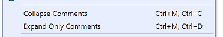

# Collapse Comments

Download this extension from the [VS Gallery](https://marketplace.visualstudio.com/items?itemName=MattLaceyLtd.CollapseComments)
or get the [CI build](http://vsixgallery.com/extension/CollapseComments.a1dfaad6-6e8d-420a-807b-ebbbc0e7a6bf/).

---------------------------------------

Simple VSIX extension that adds a command to collapse comments in the open file.

## Features

- Ctrl+M, Ctrl+C collapses all comments (and using/Import statements)
- Ctrl+M, Ctrl+D expands all comments and closes all other areas
- Ctrl+M, Ctrl+F toggles all comments
- _Should_ work with all file types that have the concept of comments
- Can also collapse (or expand) using/import directives
- Can be configured to collapse comments when a document is opened
- Also support collapsing multi-line C# strings

See the [change log](CHANGELOG.md) for changes and roadmap.

## Contribute
Check out the [contribution guidelines](CONTRIBUTING.md)
if you want to contribute to this project.

For cloning and building this project yourself, make sure
to install the [Extensibility Essentials (2017)](https://marketplace.visualstudio.com/items?itemName=MadsKristensen.ExtensibilityEssentials) or [Extensibility Essentials 2019](https://marketplace.visualstudio.com/items?itemName=MadsKristensen.ExtensibilityEssentials2019)
extension for Visual Studio which enables some features
used by this project.
