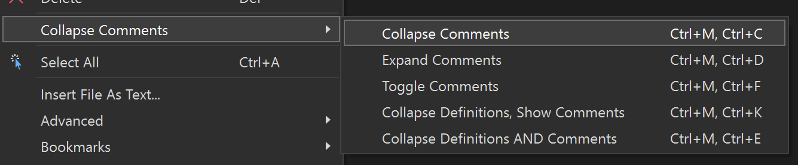

# Collapse Comments

Download this extension from the VS Marketplace for [VS 2017 & 2019](https://marketplace.visualstudio.com/items?itemName=MattLaceyLtd.CollapseComments2019)
or [VS2022](https://marketplace.visualstudio.com/items?itemName=MattLaceyLtd.CollapseComments).

---------------------------------------

Simple Visual Studio extension that adds commands to collapse (and expand) comments in the open file.

## Features

- Ctrl+M, Ctrl+C collapses all comments (and using/Import statements)
- Ctrl+M, Ctrl+D expands all comments and closes all other areas
- Ctrl+M, Ctrl+F toggles all comments
- Ctrl+M, Ctrl+K Collapse to definitions and show comments
- Ctrl+M, Ctrl+E Collapse to definitions and collapse comments
- _Should_ work with all file types that have the concept of comments
- Can also collapse (or expand) using/import directives
- Can be configured to collapse comments when a document is opened
- Also support collapsing multi-line C# strings

Please note. If the shortcuts don't seem to be working, [check that they are not also being used by something else](https://learn.microsoft.com/en-us/visualstudio/ide/identifying-and-customizing-keyboard-shortcuts-in-visual-studio?view=vs-2022#identify-a-keyboard-shortcut).

See the [change log](CHANGELOG.md) for changes and roadmap.

---------------------------------------

## Contribute

Check out the [contribution guidelines](CONTRIBUTING.md)
if you want to contribute to this project.

For cloning and building this project yourself, make sure
to install the [Extensibility Essentials (2022)](https://marketplace.visualstudio.com/items?itemName=MadsKristensen.ExtensibilityEssentials2022)
extension for Visual Studio which enables some features
used by this project.
